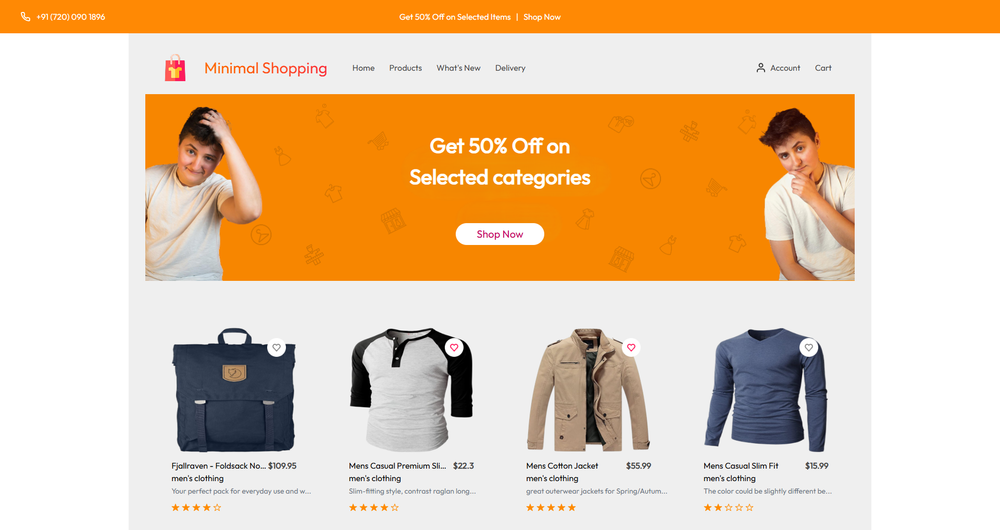

# 🛒 minimal-shopping

A minimal e-commerce web application built with **React + TypeScript + Tailwind CSS + Vite**.

---

# 🚀 Live Demo

## 🔗 https://minimal-shopping-sable.vercel.app


## 🖼️ Preview

<p align="center">
 
</p>


---

## 🧰 Tech Stack

- ⚛️ React
- 🟦 TypeScript
- ⚡ Vite
- 🎨 Tailwind CSS
- 🌐 React Router DOM
- 📦 NPM

---

## 📦 Installation

Clone the repository:

```bash
git clone https://github.com/Reza-Bamoniri/Minimal-Shopping.git

```

# ▶️ Running the Project

## Start the development server:

```
cd minimal-shopping


npm install


npm run dev
```
## Build for production:
```
npm run build

npm run preview
```


# ✨Features
- Minimal and modern UI
- Fully responsive design
- Product listing pages
- React Router navigation
- Clean and scalable structure
- Built with TypeScript for type safety


---

# 🌐 Deployment

### This project is deployed on Vercel.